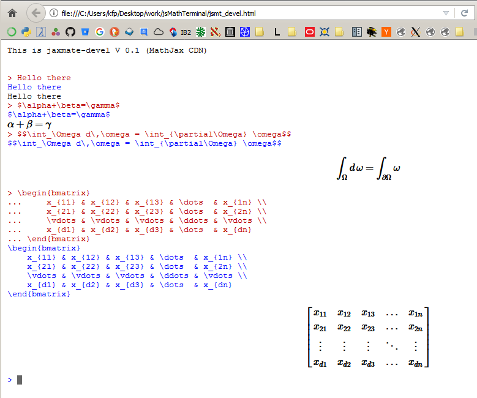

# jaxMaTe
Math*Jax* enabled *Ma*thematics *Te*rminal

This is just a prototype to test [MathJax](https://www.mathjax.org/) I/O.
The file [jsmt_devel.html](devel/jsmt_devel.html) contains everything required to demonstrate the rendering process (standalone).
See [tutorial](tutorial/jaxmate.rst) how to use it in a [node.js](https://nodejs.org/en/) client/server application.

