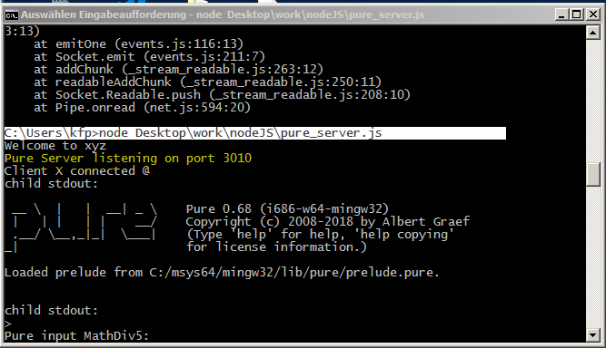
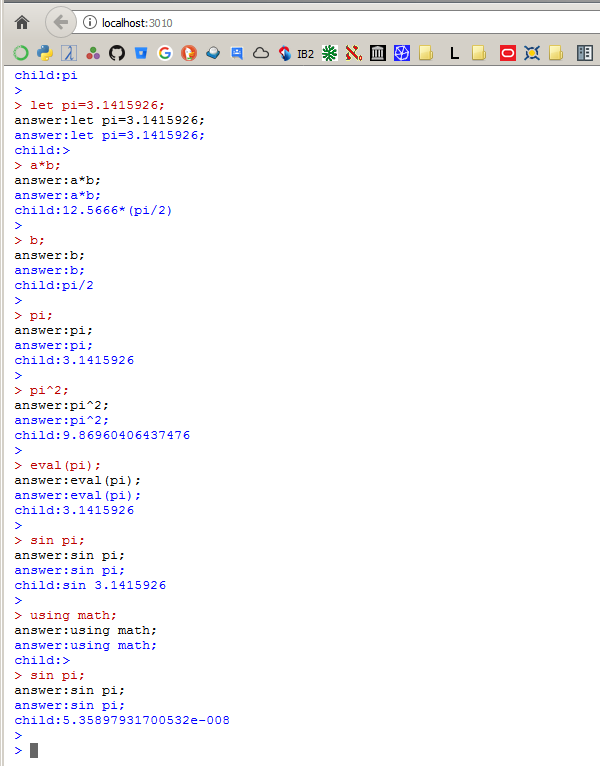
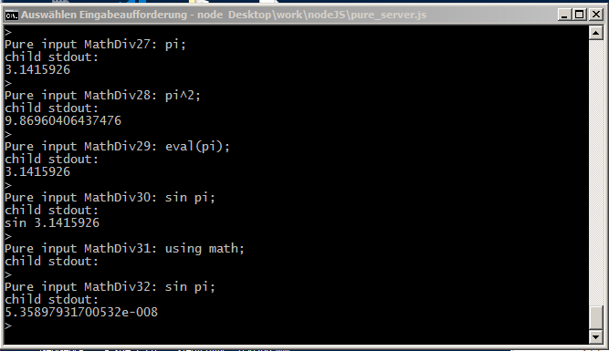
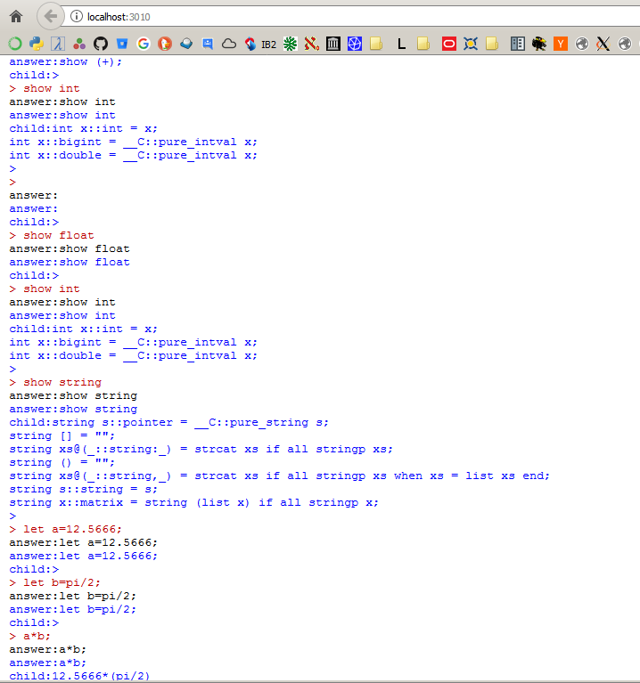

===============
jaxMaTe v0.0.2
===============

Introduction
------------

``JaxMaTe`` (Math\ *Jax* enabled *Ma*\ thematics *Te*\ rminal) is a generic web 
interface to various mathematical software that is able to emit :math:`LaTeX` 
code. The general idea is that it behaves like a common terminal/console,
however, it runs in a browser (HTML widget) and renders any output enclosed
in ``$`` or ``$$`` with MathJax.

.. image:: jaxmate_devel.png

MathJax has the advantage (compared to other methods, e.g. sixel graphics
in XTerm, MinTTy, `LaTeX2Sixel <https://github.com/nilqed/latex2sixel>`_)
that it is easy to get/copy the :math:`TeX` source code and to manipulate 
the appearance of the rendering (by right clicking on the output).

Note that jaxMaTe is conceptually different from so called *notebooks*, like
in `Jupyter <https://jupyter.org/>`_ or `SAGE <http://www.sagemath.org/>`_.
It is intended as a terminal and as such its primary purpose is to be a tool
supporting readability of interpreter's console output. 

Components used (required)
--------------------------

.. _mathjaxWP: https://en.wikipedia.org/wiki/MathJax
.. _mathjaxHome: https://www.mathjax.org/
.. _jqueryWP: https://en.wikipedia.org/wiki/JQuery
.. _jqueryHome: https://jquery.com/
.. _jqconsoleGitHub: https://github.com/replit-archive/jq-console
.. _nodejsWP: https://en.wikipedia.org/wiki/Node.js
.. _nodejsHome: https://nodejs.org/en/
.. _socketioWP: https://en.wikipedia.org/wiki/Socket.IO
.. _socketioHome: https://socket.io/
.. _npmWP: https://en.wikipedia.org/wiki/Npm_(software)
.. _npmHome: https://www.npmjs.com/
.. _nwjsHome: https://nwjs.io/ 

+--------------+-------------------+---------------------+
| Name         | Wikipedia article | Homepage            |
+==============+===================+=====================+
| MathJax      |  mathjaxWP_       | mathjaxHome_        |
+--------------+-------------------+---------------------+
| jQuery       |  jqueryWP_        | jqueryHome_         |
+--------------+-------------------+---------------------+
| jq-console   |                   | jqconsoleGitHub_    |
+--------------+-------------------+---------------------+
| node.js      |  nodejsWP_        | nodejsHome_         |
+--------------+-------------------+---------------------+
| Socket.IO    |  socketioWP_      | socketioHome_       |
+--------------+-------------------+---------------------+
| npm          |  npmWP_           | npmHome_            |
+--------------+-------------------+---------------------+
| NW.js        |  optional         | nwjsHome_           |
+--------------+-------------------+---------------------+

A MathJax Test Client
---------------------
There is a single ``HTML`` file test client (``jsmt_devel.html``) in order
to test the MathJax capabilities and the styling (``CSS``) of the console.
There is no functionality other than echoing the input as text and/or 
adding a ``div`` element which will be rendered

.. code-block :: html
    
    ...
    jqconsole.Write(input + '\n', 'jqconsole-output');
    jqconsole.Append($('
' + input + '
'));
    MathJax.Hub.Queue(["Typeset",MathJax.Hub,divID]);
    --> divID+++
    
All javascript code (except MathJax) is included as readable source in the
html file. The output is just like the picture at the beginning.

Child Process
-------------
The following code shows the principle of communication to a ``REPL`` 
(``pure`` as an example)
    
.. code-block :: javascript
    
    const { spawn } = require('child_process');
    const child = spawn('pure', ['-i']);

    var input = process.stdin.pipe(child.stdin);

    input.on('end', () => {console.log('Goodbye\n'); process.exit() });

    input.write('let x=123;let x=x+1;');

    child.stdout.on('data', (data) => {
      console.log(`child stdout:\n${data}`);
      if (data=='exit\n') {input.write('quit');
                       input.end();};
    });

Including the code snippet above into a file called ``test.js``, we can test
as follows::
    
    C:\Users\kfp\Desktop\work\nodeJS>node test.js
    child stdout:
    
     __ \  |   |  __| _ \    Pure 0.68 (i686-w64-mingw32)
     |   | |   | |    __/    Copyright (c) 2008-2018 by Albert Graef
     .__/ \__,_|_|  \___|    (Type 'help' for help, 'help copying'
    _|                       for license information.)
    
    Loaded prelude from C:/msys64/mingw32/lib/pure/prelude.pure.
    
    
    child stdout:
    >
    x+2;
    child stdout:
    126
    >
    quit
    Goodbye
    
    
    C:\Users\kfp\Desktop\work\nodeJS>
    

A minimal Server
----------------
The principle of a (``node``) server looks as follows (``pure_server.js``)

.. code-block :: javascript

    var port = 3010;
    var clientHTML = '/pure_client.html';
    
    var http = require('http');
    var express = require('express');
    var app = express();
    
    var server = http.createServer(app);
    
    // Passing the http.Server instance to the listen method
    var io = require('socket.io').listen(server);
    
    // The server starts listening
    server.listen(port);
    console.log ("Welcome to xyz");
    console.log("Pure Server listening on port " + port.toString());
    
    // Registering the route of your app that returns the HTML start file
    app.get('/', function (req, res) {
        console.log("App root");
        res.sendFile(__dirname + clientHTML);
    });
    
    // Expose the node_modules folder as static resources 
    // (to access socket.io.js in the browser)
    // maybe path.join(__dirname, 'directory')
    app.use('/static', express.static('node_modules'));
    
    
    // Handling the connection
    io.on('connection', function (socket) {
        console.log(socket.handshake);  // a lot of data without .handshake
        console.log("Client X connected @");
    
        socket.on('pure_eval', function (data) {
            console.log('Pure input '+data.id+': '+data.data);
            // EVAL HERE
            socket.emit('pure_output',{id:data.id, data:'answer:'+data.data});
        });
        
        socket.on('disconnect', function(){console.log('Client disconnect ...');});
    });
    
It's very simple, indeed, but there is no *real* evaluation yet (the 
``child process`` will come in where ``//EVAL HERE`` is a placeholder.
Of coure it is rather generic because the details might be dependent on the
``REPL`` language.

A minimal Client
----------------
The client (``pure_client.html``) is essentially the same as 
``jsmt_devel.html``, but without javascript sources, i.e. more
precisely, the ``.js`` files will be served by the ``node.js``
server itself (actually from ``node_modules``).

.. code-block :: html

    <!DOCTYPE html>
    <html>
    <head>
    <meta http-equiv="content-type" content="text/html; charset=utf-8">
    
    <!-- @STYLE SECTION -->
    
    
    <!-- SCRIPT CONFIG VARS -->
    
    
    <!-- @SCRIPT MATHJAX CONFIG -->
    <!-- http://docs.mathjax.org/en/latest/configuration.html -->
    
    
    <!-- @SCRIPT MATHJAX CDN 
    
    -->
    
    <title>Pure Client</title>
    </head>
    
    <body>
    
    <!-- @DIV CONSOLE -->
    

  
    
    <!-- -->
    
    
    
    
    
    
    
    
    <!-- @SCRIPT START -->
    
    
    </body>
    </html>

Combining Child Process and Server
----------------------------------
Now we may include the child process to the server code, getting a 
working prototype

.. code-block :: javascript

    // Spawning App
    const { spawn } = require('child_process');
    const child = spawn('pure', ['-i']);
    
    var input = process.stdin.pipe(child.stdin);
    
    
    input.on('end', () => {console.log('Goodbye\n'); process.exit() });
    
    input.write('let x=123;let x=x+1;');
    
    // Server
    var port = 3010;
    var clientHTML = '/pure_client.html';
    
    var http = require('http');
    var express = require('express');
    var app = express();
    
    var server = http.createServer(app);
    
    // Passing the http.Server instance to the listen method
    var io = require('socket.io').listen(server);
    
    // Child on data event
    child.stdout.on('data', (data) => {
      console.log(`child stdout:\n${data}`);
      io.emit('pure_output',{id:data.id, data:'child:'+data});
      if (data=='exit\n') {input.write('quit');
                       input.end();};
    });
    
    
    // The server starts listening
    server.listen(port);
    console.log ("Welcome to xyz");
    console.log("Pure Server listening on port "+ port.toString());
    
    // Registering the route of your app that returns the HTML start file
    app.get('/', function (req, res) {
        console.log("App root");
        res.sendFile(__dirname + clientHTML);
    });
    
    // Expose the node_modules folder as static resources 
    // (to access socket.io.js in the browser)
    // maybe path.join(__dirname, 'directory')
    app.use('/static', express.static('node_modules'));
    
    
    // Handling the connection
    io.on('connection', function (socket) {
        //console.log(socket.handshake);  // a lot of data without .handshake
        console.log("Client X connected @");
    
        socket.on('pure_eval', function (data) {
            console.log('Pure input '+data.id+': '+data.data);
            input.write(data.data+'\n');
            socket.emit('pure_output',{id:data.id, data:'answer:'+data.data});
        });
        
        socket.on('disconnect', function(){console.log('Client disconnect ...');});
    });
    

Let's go
--------
1. Start the server::
    
    node pure_server.js

2. Start the client::
    
    (firefox) localhost:3010
    

3. Pure interactive ...

